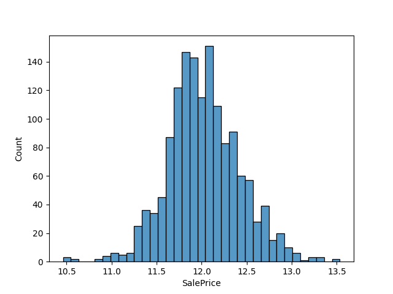
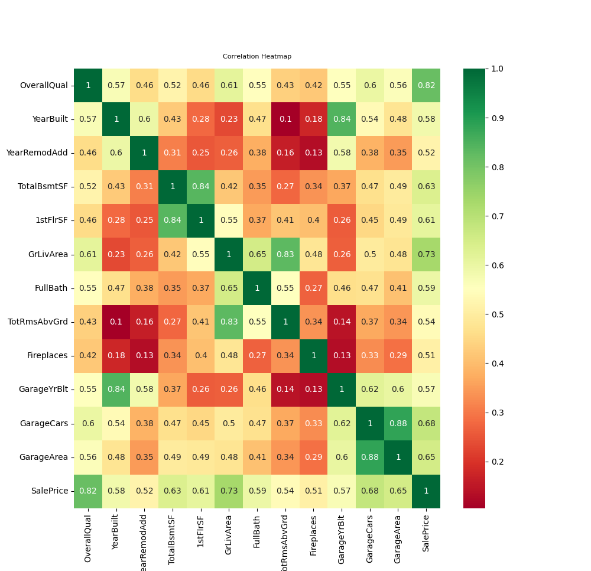
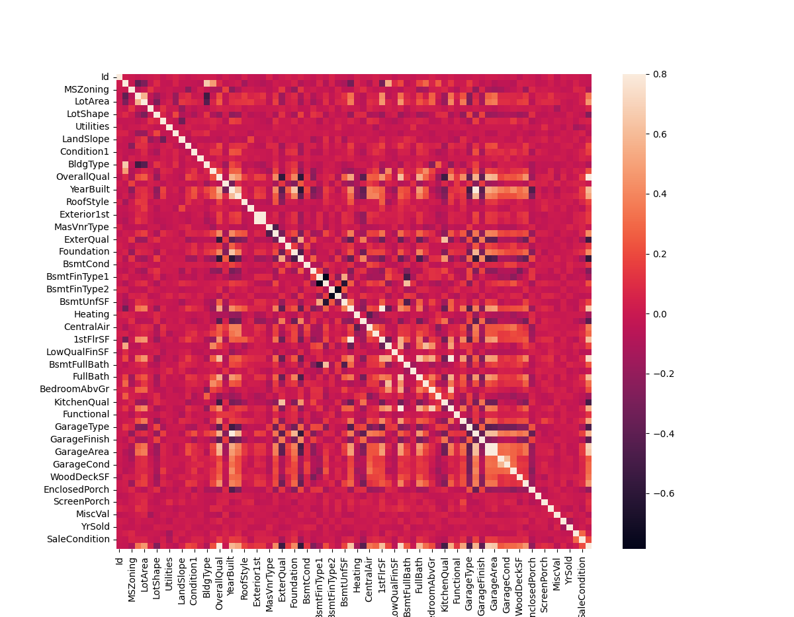

<h1> House Price Prediction </h1>

 This is an attempt at using previous housing sale data, to predict house price.
This repository contains preprocessing work - to remove bad data and create additional features.
This data is then used to train an XGB machine learning algorithm 

<h2> Exploratory Data Analysis </h2>
Here are a few finding that were discovered during the EDA stage.

<h2> What is XGBoost and how does it work? </h2>

 XGBoost stands for eXtreme Gradient Boosted trees. It 
is a popular machine learning method, which regularly wins kaggle competitions.
It is an ensemble method (takes a model and make multiple versions of it chained together).
Each tree boosts attributes that led to misclassifications of previous tree. It has various useful features:
 <ul>
  <li>Regularized boosting (prevents overfitting).</li>
  <li>Parallel Processing.</li>
  <li>Can cross-validate at each iteration.</li>
  <li>Tree pruning - unlike normal trees which stop adding branches, XGBoost will keep going deeper and then prune the tree</li>
</ul> 
XGBoost builds the first model and calculates the error for each observation in the dataset. It then builds a new model
to predict those errors (residuals). These errors are then used to correct (by a factor of the learning rate) the model by creating a new tree. 
You are building a model based on the previous errors. This process gets repeately done.
A good video explaining this in further detail can be found <a href="https://www.youtube.com/watch?v=PxgVFp5a0E4">here</a>.
<a href="https://stats.stackexchange.com/questions/173390/gradient-boosting-tree-vs-random-forest">Here</a> is a good reference explaining difference between RF and Gradient Boosting.
<h3> How is XGBoost different to boosting?</h3>
 <ul>
  <li>Computes 2nd order gradient to figure out direction of gradient.</li>
  <li>Uses L1 and L2 Regularization.</li>
  <li>Parrallelized for speed.</li>
</ul> 

<h2> Future Plans </h2>
 <ul>
  <li>Test out a deep learning model</li>
</ul> 